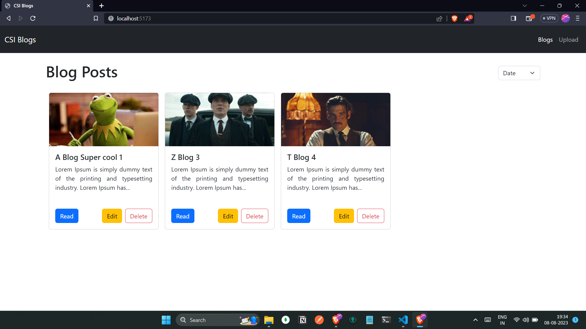

# CSI Blog App

Welcome to the CSI Blog App! This is a simple and responsive blog application built using React. It offers features such as responsiveness, local storage for storage management, and contexts for state management.

## Features

- **Responsive Design**: The application is designed to be responsive, providing an optimal viewing experience on various devices, including desktops, tablets, and mobile phones.

- **Local Storage**: The app utilizes the browser's local storage to save and manage blog posts. This means your blog posts will be persisted even after you close the browser or refresh the page.

- **Contexts for State Management**: Contexts are used to manage the global state of the application. This allows for efficient data sharing between components without the need for excessive prop drilling.

## Installation

1. Clone the repository: `git clone https://github.com/VighneshManjrekar/csi-blog-task.git`
2. Navigate to the project directory: `cd csi-blog-task`
3. Install dependencies: `npm install`
4. Start the app: `npm run dev`

## Usage

- Access the application in your web browser at `http://localhost:5173/`.
- Create, edit, and delete blog posts.
- Changes are saved to local storage, ensuring data persistence.
- Explore the responsive design on different devices.

## Technologies Used

- React
- HTML
- CSS
- JavaScript
- Bootstrap

## Structure

The project structure follows a standard React application layout:

- `src/components`: Contains various React components used in the app.
- `src/components/contexts`: Holds the context providers for state management.
- `src/App.js`: The main component where the app starts.

## Demo

Click on the image to watch project demo
